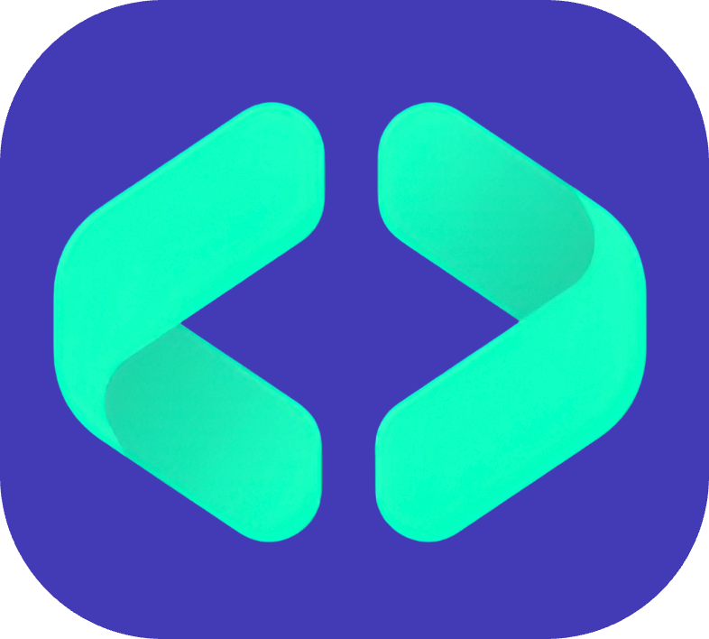

<p align="center">
  
</p>

<h1 align="center">CodeRush</h1>

<p align="center">
  A high-speed developer terminal environment and instant cloud code-sharing CLI engineered to publish, synchronize, and pull codebase files across disparate machines with zero friction, live terminal animations, and Grok-inspired pitch-black aesthetics.
</p>

<p align="center">
  <a href="https://github.com/sanketpadhyal/CodeRush">GitHub Repository</a>
  |
  <a href="https://www.npmjs.com/package/coderush-cli">npm Package</a>
  |
  <a href="https://www.sanketpadhyal.in">Developer Website</a>
</p>

<p align="center">
  <a href="https://nodejs.org">
    
  </a>
  <a href="https://www.typescriptlang.org">
    
  </a>
  <a href="https://www.npmjs.com/package/coderush-cli">
    
  </a>
  <a href="https://backend.coderush.tech">
    
  </a>
  <a href="https://github.com/sanketpadhyal/CodeRush">
    
  </a>
</p>

## Overview

CodeRush is a developer terminal CLI that eliminates traditional file-transfer friction, SSH setup, and Git branching overhead for rapid snippet and file sharing. With a single terminal command, developers can serve any local source file to the cloud, generate a short 6-character alphanumeric share code, and instantly pull that exact file onto any other computer, remote VM, Docker container, or cloud workstation.

The CLI features a Grok-inspired pitch-black full-screen alternate buffer interface (`\x1b[?1049h`), interactive ASCII chevron animations, responsive terminal geometry adaptation, clean typography, and zero gimmicks.

Under the hood, CodeRush leverages a hybrid transport architecture: it communicates with a high-speed production REST API running on `https://backend.coderush.tech` with seamless direct cloud fallback, ensuring instantaneous reads and writes under any network condition.

> [!IMPORTANT]
> **Production Ready & Open Source**
> The **CodeRush CLI, interactive terminal render engine, file synchronizer, and backend services** are open source.
> Explore the codebase or contribute directly at [sanketpadhyal/CodeRush](https://github.com/sanketpadhyal/CodeRush).

> [!NOTE]
> **Hybrid Cloud Transport**
> CodeRush resolves code publishing through an automated dual-tier transport: Primary REST Gateway (`https://backend.coderush.tech`) &rarr; Direct Cloud Firestore Service Account fallback.

## Product Links

| Product Surface | Link |
| --- | --- |
| npm Package Registry | [npmjs.com/package/coderush-cli](https://www.npmjs.com/package/coderush-cli) |
| GitHub CLI Repository | [sanketpadhyal/CodeRush](https://github.com/sanketpadhyal/CodeRush) |
| GitHub Backend Repository | [sanketpadhyal/CodeRush-Backend](https://github.com/sanketpadhyal/CodeRush-Backend) |
| Cloud API Health Endpoint | [backend.coderush.tech/health](https://backend.coderush.tech/health) |
| Developer Portfolio | [sanketpadhyal.in](https://www.sanketpadhyal.in) |

## What Happens During Code Serving & Pulling

1. User launches `coderush` or executes `coderush serve`.
2. The terminal switches to an alternate screen buffer (`\x1b[?1049h`), hides the hardware cursor, sets true pitch-black RGB background (`#000000`), and begins rendering the animated chevron brand logo.
3. The developer inputs their name and local file path (`⚲ Enter file path to serve:`).
4. `FileTool` resolves absolute paths, extracts the file basename, extension, language formatting, and reads the raw source content.
5. The CLI dispatches a payload to `https://backend.coderush.tech/generate` with a dark blue high-speed loading spinner.
6. The backend generates a collision-resistant 6-character share code (e.g. `A7B2X9`), stores the document, and timestamps the transaction.
7. The terminal displays the confirmation banner (`✔ Successfully served to server!`) along with the share code and ready-to-run pull snippet.
8. On any destination machine, the developer runs `coderush pull <CODE>`.
9. The CLI fetches the payload, recreates the exact original file, saves it into the target directory, and logs confirmation.

## Key Features

### Terminal Experience & Grok Interface

- **Pitch-Black Aesthetic**: Pure true-color black terminal background (`#000000`) with ANSI xterm scrollback purge.
- **Dynamic Wave Logo Animation**: Multi-frame animated `< >` brand chevrons running continuously in the terminal header.
- **Dynamic Geometry**: Real-time terminal resize tracking and vertical/horizontal centering calculations.
- **Alternate Screen Buffer**: Restores developer terminal history cleanly upon exit with zero leftover artifacts.

### Cloud Code Serving & Retrieval Engine

- **Instant File Serving**: Publish any configuration, script, or source file with a single prompt or command.
- **One-Command Pull**: Fetch code directly to your local file system via `coderush pull <CODE>`.
- **Automatic Extension & Language Detection**: Preserves file extensions (`.ts`, `.py`, `.js`, `.json`, `.yaml`, etc.) and syntax identity.
- **Non-Destructive Overwrites**: Validates directory paths before writing pulled files to disk.

### Hybrid Transport & Resiliency

- **Cloud Gateway**: Primary routing through high-performance Express server on `https://backend.coderush.tech`.
- **Direct Database Fallback**: Automated fallback to direct cloud storage ensuring high availability.
- **Custom Backend Support**: Fully customizable through `CODERUSH_API_URL` environment variable.

## CLI Commands

| Command | Alias | Description |
| --- | --- | --- |
| `coderush` | — | Open the interactive Grok menu interface |
| `coderush serve` | `coderush push` | Serve a local code file directly to CodeRush cloud |
| `coderush pull [code]` | — | Pull remote code file to local workspace using share code |
| `coderush start` | — | Quick onboarding and file serving wizard |
| `coderush env` | — | Launch the CodeRush developer environment screen |
| `coderush --help` | `-h` | Display full command list and CLI options |
| `coderush --version` | `-V` | Output current CLI version |

## Project Structure

| Directory | Description |
| --- | --- |
| `src/` | TypeScript source codebase for the CLI application |
| `src/ui/` | Interactive terminal UI, animated logo renderer, and Grok menu |
| `src/screens/` | Screen workflows for Get Started (serving) and Environment (pulling) |
| `src/services/` | Cloud REST API client, Firestore fallback driver, and file system helpers |
| `src/tools/` | Static file tool utilities for reading, writing, and resolving paths |
| `src/theme/` | Pitch-black color palette, terminal escape sequences, and layout formatters |
| `src/assets/` | Brand logos and graphic assets |
| `dist/` | Compiled ES module distribution binaries |
| `.github/workflows/` | GitHub Actions CI/CD pipeline for multi-version Node.js builds |

## Main Files

| File | Purpose |
| --- | --- |
| `src/cli.ts` | CLI executable entry point with Commander.js routing and lifecycle hooks |
| `src/ui/menu.ts` | Full-screen interactive Grok menu with frame animations and keyboard navigation |
| `src/ui/logo.ts` | Multi-frame gradient wave logo engine for CodeRush `< >` chevrons |
| `src/screens/get-started.screen.ts` | Serving wizard, developer name prompt, file selector, spinner, and share code card |
| `src/screens/environment.screen.ts` | Code pull workflow, share code input, file downloader, and file-write verification |
| `src/services/api.service.ts` | Unified cloud HTTP client connecting to `https://backend.coderush.tech` with fallback |
| `src/services/firestore.service.ts` | Direct cloud Firestore driver with automatic ID generation |
| `src/tools/file.tool.ts` | File reader, writer, path resolver, and filename extraction tools |
| `src/theme/theme.ts` | Terminal color scheme, true-black background hooks, and centering helpers |

## Tech Stack

| Component | Technology |
| --- | --- |
| Runtime | Node.js (v18+) |
| Language | TypeScript 5.0+ |
| CLI Framework | Commander.js 12 |
| Terminal Prompts | Inquirer 9 |
| Styling & Colors | Chalk 6, Gradient-String 3, Boxen 9 |
| Spinners & Progress | Ora 9 |
| Cloud Backend | Express.js 4, Node.js, Railway |
| Database | Firebase Firestore Admin SDK |
| CI/CD | GitHub Actions |

## Environment Variables & Configuration

The CLI comes pre-configured with the production cloud endpoint. To point to a custom or local backend:

```env
# Optional: Override backend URL
CODERUSH_API_URL=https://backend.coderush.tech
```

## Getting Started

### Installation

#### Option 1: Global Installation (Recommended)
Install globally to use the `coderush` command from anywhere in your terminal:

```bash
npm install -g coderush-cli
```

#### Option 2: Run via npx (No Installation)
Run instantly without installing:

```bash
npx coderush-cli
```

### Usage Examples

#### 1. Interactive Menu
Simply run:
```bash
coderush
```

#### 2. Serve a Code File
```bash
coderush serve
```

#### 3. Pull a Remote File
```bash
coderush pull A7B2X9
```

## Security & Privacy

- All communication with `backend.coderush.tech` is strictly enforced over encrypted HTTPS/TLS channels.
- Only source code payloads explicitly selected by the developer are served to the cloud.
- Package builds distributed to npm contain solely compiled binaries from `dist/` with zero credentials or private configuration files.

## Developed By

Crafted by **Sanket Padhyal**.

- **Website**: [www.sanketpadhyal.in](https://www.sanketpadhyal.in)
- **GitHub**: [@sanketpadhyal](https://github.com/sanketpadhyal)
- **CLI Repository**: [sanketpadhyal/CodeRush](https://github.com/sanketpadhyal/CodeRush)
- **Backend Repository**: [sanketpadhyal/CodeRush-Backend](https://github.com/sanketpadhyal/CodeRush-Backend)
